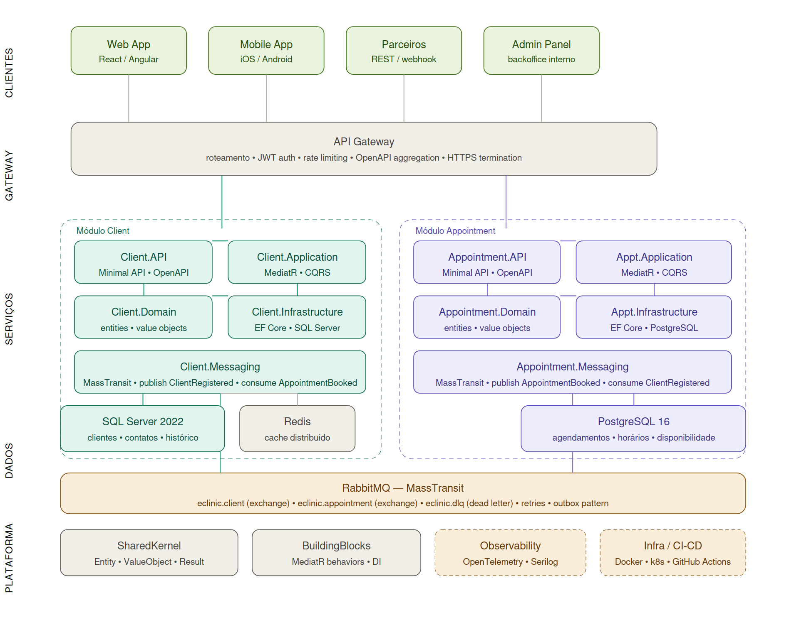

# eClinic 🏥

O **eClinic** é um projeto de evolução de estudo focado na implementação prática de arquiteturas modernas. O objetivo principal é consolidar conhecimentos em **Microserviços**, **Mensageria (Events)** e **Observabilidade (Telemetria)** utilizando o ecossistema .NET.

## 🚀 Tecnologias e Conceitos

- **Runtime:** .NET 10
- **Arquitetura:** - Domain-Driven Design (DDD)
  - Clean Architecture
  - CQRS (com MediatR)
- **Persistência:** Entity Framework Core
- **Comunicação e Eventos:** RabbitMQ (Integration Events)
- **Observabilidade:** Telemetria com OpenTelemetry (Metrics, Tracing, Logging)

## 🎯 Objetivos do Projeto


## 🏗️ Estrutura do Projeto

O projeto é dividido em camadas para garantir o desacoplamento e a testabilidade:

- **Domain:** Entidades de negócio, interfaces de repositório, Enums e Value Objects.
- **Application:** Handlers (MediatR), Commands, Queries e DTOs de resposta.
- **Infrastructure:** Implementação de repositórios, contexto do banco de dados (EF Core) e integrações externas.
- **API (Host):** Endpoints REST e configurações de Injeção de Dependência.
- **Shared:** Código compartilhado entre módulos, interfaces base e utilitários de projeto.

## 🛠️ Módulos Atuais

- [x] **Client Module:** Gerenciamento de pacientes/clientes, implementando CRUD com padrões de comando e consulta.

## 🔮 Roadmap de Evolução

Conforme o projeto evoluir, novos módulos e funcionalidades serão acrescentados:
- [ ] **Módulo de Agendamentos:** Gestão de consultas e horários.
- [ ] **Módulo Financeiro:** Faturamento e controle de pagamentos.
- [ ] **Módulo de Notificações:** Envio de alertas via Events (RabbitMQ).
- [ ] **Telemetria:** Dashboard centralizado para monitoramento de performance.
- [ ] **Containerização:** Docker e orquestração para os microserviços.

---

## 💻 Como Rodar o Projeto

### Pré-requisitos
- SDK .NET 10
- SQL Server (ou Docker para rodar uma instância)
- RabbitMQ (para funcionalidades de eventos)

### Configuração
1. Clone o repositório:
   ```bash
   git clone [https://github.com/acostacunha/eClinic.git](https://github.com/acostacunha/eClinic.git)
